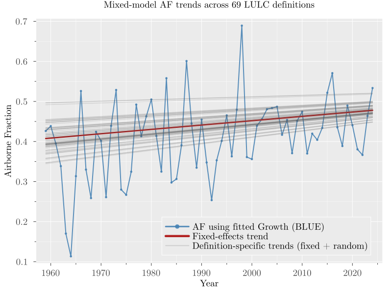
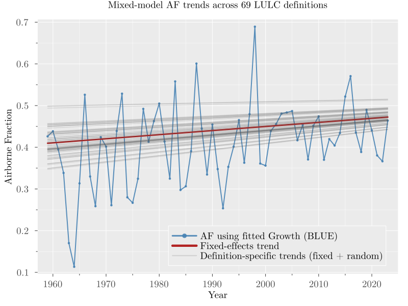
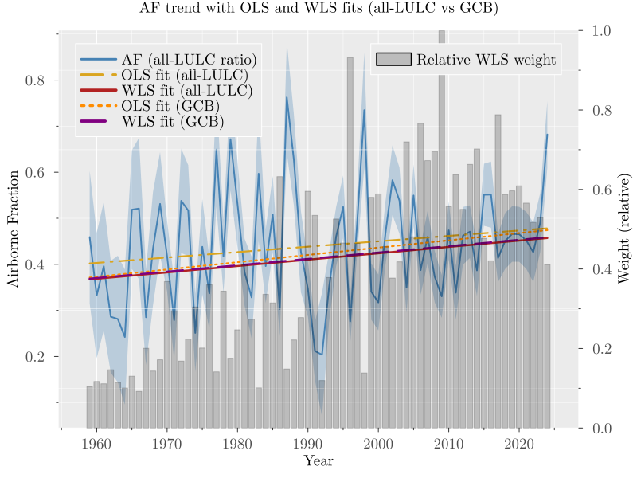

## Background {.unnumbered}

The amount of anthropogenic carbon dioxide ($CO_2$) that can be emitted while still meeting a given temperature goal, known as the remaining carbon budget, depends critically on how efficiently the land–ocean system continues to absorb $CO_2$ emissions. In recent decades, the share of anthropogenic $CO_2$ emissions that remains in the atmosphere, known as the airborne fraction (AF), has been estimated to be around 0.45, but whether it has increased over time remains contested [@Canadell2007; @Raupach2007; @Knorr2009; @Ballantyne2012; @LeQuere2009; @bennedsenEvidenceTrendCO22023; @bennedsenRegressionbasedApproachCO22024;@bennettQuantificationAirborneFraction2024;@veravaldes2025robustestimationco2]. 

In its classical form, AF is a yearly ratio of atmospheric growth to total anthropogenic emissions, computed as the sum of fossil fuel emissions and land-use and land-cover change emissions as

$$
AF_t = \frac{G_t}{FF_t + LULC_t},
$${#eq-af-def}

where $G_t$ is the annual atmospheric $CO_2$ growth, $FF_t$ is fossil fuel emissions excluding carbonation, and $LULC_t$ is land-use and land-cover change emissions. AF is a key carbon-cycle diagnostic, with implications for carbon-cycle feedbacks and near-term mitigation planning [@Canadell2007; @Raupach2007; @Friedlingstein2025].

A persistent concern is that AF inference depends on the treatment of land-use and land-cover change (LULC) emissions, which are uncertain and model-dependent in annual carbon-budget accounting. The Global Carbon Budget (GCB) 2025 [@Friedlingstein2025] provides one column of LULC emissions as the average of three bookkeeping models (BLUE [@Hansis2015], OSCAR [@Gasser2020], LUCE [@Qin2024]), but a broader set of model-based LULC alternatives can be constructed from the same source. Estimates that do not incorporate this multi-source LULC information can be underpowered and inference on trend direction becomes less reliable.

Here we address that issue with a statistical design that uses all repeated LULC measurements in a mixed-effects trend framework [@Henderson1953; @Bolker2009] to obtain more reliable inference. The main specification estimates AF trends from a panel of yearly AF values constructed from each LULC measurement series, with random intercepts and random slopes capturing between-series heterogeneity and inducing within-series dependence over time. As a robustness exercise, we also estimate a two-stage measurement-error weighted least squares (WLS) model that propagates denominator uncertainty from repeated LULC measurements into annual AF uncertainty [@Fuller1987; @Carroll2006].

Across specifications that incorporate the multi-source LULC information, we find robust evidence that AF has increased over 1959-2024, and that this conclusion is not driven by the final observation (2024), which shows a large AF value. By contrast, ordinary least squares (OLS) specifications that do not incorporate denominator measurement information provide weaker evidence of a positive trend and are more sensitive to endpoint exclusion. Taken together, the results clarify why AF trend significance has been elusive in the literature and strengthen evidence that a growing share of emitted carbon dioxide is accumulating in the atmosphere.


## Data {.unnumbered}

We use annual Global Carbon Budget 2025 data for 1959-2024, with atmospheric growth $G_t$ from NOAA/ESRL global concentration trends [@Lan2025], fossil emissions excluding carbonation $FF_t$ from the Global Carbon Project fossil dataset [@Friedlingstein2025], and a panel of 69 LULC measurements per year: BLUE [@Hansis2015], OSCAR [@Gasser2020], LUCE [@Qin2024], and peat-augmented [@Conchedda2020; @Mueller2021; @Qiu2021] process-based land-model combinations drawn from the GCB model ensemble [@Haverd2018; @Melton2020; @Lawrence2019; @Fisher2015; @Tian2015; @Ma2022; @Yang2023; @Needham2025; @Felzer2018; @Xia2024; @Yue2024; @Shu2020; @Reick2021; @Poulter2011; @Smith2014; @Schaphoff2018; @Lienert2018; @Vuichard2019; @Walker2017; @Kato2013; @Ito2019] (see Methods). The data are shown in @fig-data.

Two LULC means can be constructed from the panel. First, the GCB LULC mean, defined as the mean of the three bookkeeping models (BLUE, OSCAR, and LUCE), corresponds to the LULC column used in the Global Carbon Budget. Second, the all-LULC mean, defined as the cross-series mean across all 69 LULC measurements. The literature has typically used the GCB LULC mean in AF trend estimation, but we show that incorporating the full set of LULC measurements increases the precision of trend estimates and provides more robust inference on trend direction.

To account for the natural variability in the atmospheric growth series [@LeQuere2009; @bennedsenRegressionbasedApproachCO22024; @bennettQuantificationAirborneFraction2024; @veravaldes2025robustestimationco2], we construct a natural variability adjusted growth series by regressing the observed growth on total anthropogenic emissions (fossil plus LULC) and indices of variability in the El Niño-Southern Oscillation (ENSO) and the Volcanic Aerosol Index (VAI). The fitted values from this regression are used as the natural variability adjusted growth series, which is shown in @fig-data and used in the main analysis. The details of the regression are described in Methods. 

::: {.content-visible when-format="html"}
{#fig-data fig-width=8.4 fig-height=4.9}
:::

::: {.content-visible unless-format="html"}
{#fig-data fig-width=8.4 fig-height=4.9}
:::


## Identification strategy {.unnumbered}

The empirical question is whether AF has a positive linear trend. The key design choice is how to use the full panel of repeated LULC measurements while accounting for within-series dependence and cross-series heterogeneity. OLS on a collapsed annual series discards panel information and hence provides less reliable inference, as shown in @tbl-trend-gcb and @tbl-trend-gcb-2023. Natural variability in the atmospheric growth series also adds noise to AF estimates, so we use a natural-variability-adjusted growth series in the main analysis to obtain more precise trend estimates. Our preferred specification is a mixed-effects model with random intercepts and random slopes by LULC series, allowing correlation across years within each series and capturing unobserved heterogeneity in LULC measurements [@Henderson1953; @Bolker2009] (see Methods).

For each LULC measurement series, we construct a series of AF estimates by year (@eq-af-def), and the model estimates a common time trend across all series while allowing for series-specific intercepts and slopes. Formally, the model can be written as
$$
AF_{t,j} = \alpha_j + \beta_j t +\varepsilon_{t,j},
$$

where

$$
\alpha_j \sim N(\mu_\alpha, \sigma_\alpha^2),\quad
\beta_j \sim N(\mu_\beta, \sigma_\beta^2),\quad
\varepsilon_{t,j} \sim N(0, \sigma_\varepsilon^2).
$$

Here $\mu_\alpha$ and $\mu_\beta$ are the fixed effects (overall intercept and slope), while $\sigma_\alpha^2$ and $\sigma_\beta^2$ capture the variability in intercepts and slopes across LULC measurement series. The error term $\varepsilon_{t,j}$ captures idiosyncratic noise. The key parameter of interest is $\mu_\beta$, which captures the average trend across all LULC measurement series. Filtering growth for natural variability and incorporating the full panel of LULC measurements allows us to obtain more precise and robust estimates of the AF trend.


## Results {.unnumbered}

### Main estimates {.unnumbered}

The main results from estimating the mixed-effects model in the full sample are shown in @tbl-mixed-effects. The table includes natural-variability-adjusted ($AF^{ADJ}$) and unadjusted ($AF^{RAW}$) growth specifications, with and without AR(1) effects in the residuals to control for potential autocorrelation (see Methods).

The slope is positive and statistically significant in all specifications, indicating strong evidence of an increasing AF trend across LULC measurement series. The estimated intercept is around 0.41 and the slope is around 0.0011 per year, implying an increase of about 0.07 in AF over 1959-2024. These estimates are comparable with the approximately 0.45 AF level reported in the literature [@Raupach2007;@Knorr2009;@Gloor2010CarbonFeedbackAF;@bennedsenRegressionbasedApproachCO22024;@bennedsenEvidenceTrendCO22023;@veravaldes2025robustestimationco2], while identifying a positive long-run trend when all LULC information is incorporated. Note that the mixed-effects model reduces uncertainty in the estimates by jointly using all available LULC information, which allows us to obtain more precise estimates and robust inference on trend direction.

| Mixed-effects model (1959-2024) | $AF^{ADJ}$ | $AF^{ADJ}$ (AR1) | $AF^{RAW}$ | $AF^{RAW}$ (AR1) |
|:------|----:|----:|----:|----:|
| Intercept | 0.407572 | 0.408555 | 0.406959 | 0.406784 |
| SE (Intercept) | 0.005324 | 0.005546 | 0.005573 | 0.005673 |
| p-value (Intercept) | 1.0E-5 | 1.0E-5 | 1.0E-5 | 1.0E-5 |
| Slope | 0.001082 | 0.00107 | 0.001103 | 0.001117 |
| SE (Slope) | 8.6E-5 | 0.0001 | 0.000102 | 0.000108 |
| p-value (Slope) | 1.0E-5 | 1.0E-5 | 1.0E-5 | 1.0E-5 |
| AR1 |  | 0.177702 |  | 0.063011 |
| SE (AR1) |  | 0.031018 |  | 0.030731 |
| p-value (AR1) |  | 1.0E-5 |  | 0.040326 |
: Mixed-effects model estimates for the full sample (1959-2024). Specifications with natural variability adjusted (ADJ) and unadjusted (RAW) growth rates are shown with and without AR(1) effects. {#tbl-mixed-effects}

@fig-mixed-effects-trend shows the AF series for each LULC measurement together with the overall mixed-effects trend line for the specification using the natural-variability-adjusted growth series and the full sample. The figure shows a clear positive trend across the panel of AF series, with the mixed-effects model capturing this common signal while allowing for series-specific heterogeneity. Note that the figure shows AF computed using the BLUE LULC series for illustrative purposes, but trend lines are estimated using the full panel of LULC measurements.

::: {.content-visible when-format="html"}

::: {#fig-mixed-effects layout-ncol=2}

{#fig-mixed-effects-trend fig-width=8.4 fig-height=4.9}

{#fig-mixed-effects-trend-2023 fig-width=8.4 fig-height=4.9}

{#fig-wls-trend-full fig-width=8.4 fig-height=4.9}

{#fig-wls-trend-2023 fig-width=8.4 fig-height=4.9}

AF series with mixed-effects and WLS model trends across LULC measurement series.

:::

:::

::: {.content-visible unless-format="html"}

::: {#fig-mixed-effects layout-ncol=2}

{#fig-mixed-effects-trend fig-width=8.4 fig-height=4.9}

{#fig-mixed-effects-trend-2023 fig-width=8.4 fig-height=4.9}

{#fig-wls-trend-full fig-width=8.4 fig-height=4.9}

{#fig-wls-trend-2023 fig-width=8.4 fig-height=4.9}

AF series with mixed-effects and WLS model trends across LULC measurement series.

:::

:::


### Endpoint and model specification robustness {.unnumbered}

AF shows a large value in the final year (2024), so we re-estimate the mixed-effects specification on the sample ending in 2023 to check whether the result is driven by that observation. Results are shown in @tbl-mixed-effects-2023 and @fig-mixed-effects-trend-2023. The slope remains positive and statistically significant, indicating that the increasing AF trend is not driven by the final observation. The slope estimates are smaller, consistent with a contribution from the 2024 large value, but the direction and inference are unchanged.

| Mixed-effects model (1959-2023) | $AF^{ADJ}$ | $AF^{ADJ}$ (AR1) | $AF^{RAW}$ | $AF^{RAW}$ (AR1) |
|:------|----:|----:|----:|----:|
| Intercept | 0.409783 | 0.411223 | 0.41326 | 0.413403 |
| SE (Intercept) | 0.005345 | 0.005564 | 0.005586 | 0.005677 |
| p-value (Intercept) | 1.0E-5 | 1.0E-5 | 1.0E-5 | 1.0E-5 |
| Slope | 0.000978 | 0.000944 | 0.000808 | 0.000806 |
| SE (Slope) | 8.8E-5 | 0.000102 | 0.000103 | 0.000109 |
| p-value (Slope) | 1.0E-5 | 1.0E-5 | 1.0E-5 | 1.0E-5 |
| AR1 |  | 0.17795 |  | 0.056406 |
| SE (AR1) |  | 0.031115 |  | 0.029828 |
| p-value (AR1) |  | 1.0E-5 |  | 0.058622 |
: Mixed-effects model estimates for the sample ending in 2023 (1959-2023). Specifications with natural variability adjusted (ADJ) and unadjusted (RAW) growth rates are shown with and without AR(1) effects. {#tbl-mixed-effects-2023}

An additional estimation approach that explicitly incorporates denominator measurement uncertainty is WLS estimation of the AF trend, where the weights are constructed from the cross-measurement dispersion of the full LULC panel. Specifically, we estimate a delta-method uncertainty proxy for each annual AF estimate using the cross-measurement dispersion of the full 69-series LULC panel, and use these proxies in a WLS specification [@Fuller1987; @Carroll2006; @Oehlert1992] (see Methods). @tbl-trend-WLS reports the results using the all-LULC mean in the denominator estimated by OLS and WLS. The first two columns show the full sample (1959-2024) estimates, while the last two columns show the estimates for the sample ending in 2023 to check whether the results are driven by the large value in 2024. The WLS estimates show a positive and statistically significant slope in both samples, while OLS estimates show a positive but non-significant slope in both samples. @fig-wls-trend-full and @fig-wls-trend-2023 show the WLS trend lines together with the AF series for each LULC measurement for the full sample and the sample ending in 2023, respectively. The WLS trend lines show a clear positive trend across the panel of AF series.

| OLS and WLS | $AF^{ADJ}$ OLS (1959-2024) | $AF^{ADJ}$ WLS (1959-2024) | $AF^{ADJ}$ OLS (1959-2023) | $AF^{ADJ}$ WLS (1959-2023) |
|:------|---:|---:|---:|---:|
| Intercept | 0.401938 | 0.367286 | 0.408212 | 0.376919 |
| SE (Intercept) | 0.029843 | 0.001243 | 0.029599 | 0.001211 | 
| p-value (Intercept) | 1.0E-5 | 1.0E-5 | 1.0E-5 | 1.0E-5 | 
| Slope | 0.001172 | 0.001382 | 0.000878 | 0.001054 |
| SE (Slope) | 0.000792 | 2.8E-5 | 0.000798 | 2.8E-5 | 
| p-value (Slope) | 0.138912 | 1.0E-5 | 0.271089 | 1.0E-5 |
: Trend comparison for the WLS and OLS estimates with natural variability adjusted growth specifications. The first two columns show the full sample (1959-2024) estimates, while the last two columns show the estimates for the sample ending in 2023. {#tbl-trend-WLS}

Overall, the results show that incorporating multi-source LULC information and accounting for measurement uncertainty materially changes inference on AF trends. The mixed-effects model, which incorporates all available LULC information and accounts for within-series dependence and cross-series heterogeneity, provides robust evidence of a positive AF trend. The WLS approach, which explicitly incorporates denominator measurement uncertainty, also shows a positive and statistically significant trend. 

In contrast, OLS specifications that do not incorporate denominator measurement information provide weaker and less robust evidence, with significance that is sensitive to denominator definition and endpoint exclusion. These results highlight the value of incorporating multi-source LULC information in AF trend estimation in a way that accounts for within-series dependence and cross-series heterogeneity. OLS on a collapsed series discards this information and hence provides less reliable inference on trend direction. Our results clarify why earlier studies that did not incorporate multi-source LULC information have reported weak or inconclusive evidence of an increasing AF trend [@Canadell2007; @Raupach2007; @Knorr2009; @Ballantyne2012; @LeQuere2009; @bennedsenEvidenceTrendCO22023; @bennedsenRegressionbasedApproachCO22024;@bennettQuantificationAirborneFraction2024].

Additional robustness checks (in Methods), including OLS and WLS specifications in the unadjusted growth series and considering the GCB LULC mean instead of the all-LULC mean, show that the positive AF trend detected by WLS is robust to these alternative specifications, while OLS estimates that do not incorporate multi-source LULC information show weaker evidence of a positive trend and are more sensitive to endpoint exclusion.


## Discussion and conclusion {.unnumbered}

Using a framework that controls for natural variability in the atmospheric growth series and incorporates all available LULC information from Global Carbon Budget 2025, we find robust evidence that AF increased from 1959 to 2024. Methodologically, incorporating multi-source uncertainty materially changes inference relative to plain OLS. Endpoint tests show that this conclusion is not driven by the large value in 2024.

Our estimates imply that AF increased from about 0.41 around 1960 to about 0.48 by 2024, relative to long-used values around 0.45. For a given emissions pathway, a higher AF would be associated with faster atmospheric $CO_2$ growth than under a constant-AF baseline, potentially reducing the remaining carbon budget for a given temperature target [@Canadell2007; @Raupach2007; @Friedlingstein2025]. Quantifying the budget impact requires dedicated carbon-budget modelling beyond the scope of this study.

::: {.content-visible when-format="html"}

### References {.unnumbered}

:::

:::{#refs}
:::


# Methods {.unnumbered}

Our primary estimator is a linear mixed-effects trend model with random intercepts and random slopes for each LULC measurement series [@Henderson1953; @Bolker2009]. As a robustness check, we also estimate a measurement-error-aware airborne fraction variance using repeated yearly denominator measurements, followed by WLS trend estimation [@Fuller1987; @Carroll2006; @Oehlert1992; @Aitken1935].

## Construction of the LULC measurement panel {.unnumbered}

The repeated LULC measurements are built from the Global Carbon Budget 2025 dataset. We first extract the three bookkeeping series: BLUE [@Hansis2015], OSCAR [@Gasser2020], LUCE [@Qin2024]. Then, for each process-based land-model LULC series in the GCB ensemble that does not already include peat emissions [@Haverd2018; @Melton2020; @Lawrence2019; @Fisher2015; @Tian2015; @Ma2022; @Yang2023; @Needham2025; @Felzer2018; @Xia2024; @Yue2024; @Shu2020; @Reick2021; @Poulter2011; @Smith2014; @Schaphoff2018; @Lienert2018; @Vuichard2019; @Walker2017; @Kato2013; @Ito2019], we add one peat component measurement to make it comparable to the bookkeeping models, which include peat emissions by construction. Specifically, for each of the 22 process-based series we create 3 peat-augmented variants by adding FAO_peat, LPX_Bern_peat, and ORCHIDEE_peat [@Conchedda2020; @Mueller2021; @Qiu2021], respectively. This produces 66 derived series, and together with BLUE/OSCAR/LUCE gives a panel of 69 yearly LULC measurements.

## Accounting for natural variability {.unnumbered}

Natural factors such as volcanic eruptions and El Niño events can cause year-to-year fluctuations in atmospheric $CO_2$ growth that are not directly related to anthropogenic emissions. To account for this natural variability, we consider a specification that includes a control for the Niño 3 index, which captures El Niño–Southern Oscillation (ENSO) variability and Volcanic Aerosol Index (VAI) to capture volcanic activity. 

The specification is as follows:
$$
\hat{G}_t = \gamma_0 + \gamma_1 \hat{C}_t + \gamma_2 \text{N3}_t + \gamma_3 \text{VAI}_t + \varepsilon_{t,j},
$${#eq-growth-reg}

where $\hat{C}_t$ is the estimated total emissions (fossil fuel plus LULC), $\text{N3}_t$ is the Niño 3 index, and $\text{VAI}_t$ is the Volcanic Aerosol Index for year $t$. The error term captures idiosyncratic noise. 

In the estimation, the yearly total emissions ($\hat{C}_t$) are computed as the sum of fossil fuel emissions and the mean of the LULC panel for that year as
$$
\hat C_t = FF_t + \bar{LULC}_t, \qquad
\bar{LULC}_t = \frac{1}{n_t}\sum_{j=1}^{n_t} LULC_{tj},
$$

where $n_t=3$ for the GCB LULC mean and $n_t=69$ for the all-LULC mean. 

To account for uncertainty in the LULC measurements, we use WLS in @eq-growth-reg with weights based on the cross-measurement empirical dispersion of the full LULC panel

$$
\widehat{\operatorname{Var}}({\hat{C}_t}) = \frac{1}{n_t-1} \sum_{j=1}^{n_t} (C_{tj} - \hat{C}_t)^2,
$$

where $C_{tj} = FF_t + LULC_{tj}$ is the total emissions for year $t$ using the $j$-th LULC measurement and $n_t=69$ is the number of LULC measurements. This weighting scheme gives less weight to years with higher cross-measurement dispersion or more uncertainty in the total emissions estimate.

The variance of $\hat{G}_t$ is estimated using the delta method, which accounts for the uncertainty in the regression coefficients and the variability in the LULC measurements. For the linear model specified above, the variance of the fitted values $\hat{G}_t$ can be approximated using the delta method as

$$
\widehat{\operatorname{Var}}(\hat{G}_t) = \gamma_1^2 \operatorname{\widehat{Var}}(\hat{C}_t). 
$$

The weights used in the WLS regression are hence given by $w_t = \frac{1}{\gamma_1^2 \operatorname{\widehat{Var}}(\hat{C}_t)}$, which reflects the uncertainty in the fitted values due to the variability in the LULC measurements. 

Results from the growth regression estimated by WLS are shown in @tbl-growth-reg.

| Growth equation | Estimate | Std. error | p-value  |
|---|---:|---:|---:|---:|---:|
| Intercept | 1.071015 | 0.340529 | 0.001660 |
| Total emissions | 0.364301 | 0.038410 | 1.0E-5 |
| VAI | -17.386855 | 3.081315 | 1.0E-5 |
| ENSO | 1.054167 | 0.131682 | 1.0E-5 |
| R-squared | 0.831525 |  |  |  |  |
: Growth regression with natural variability controls. {#tbl-growth-reg}

The fitted values $\hat{G}_t$ represent the natural variability adjusted growth series, which is shown in @fig-data and used in the main analysis. The variance of the fitted values, which captures the uncertainty in the growth estimates due to variability in the LULC measurements, is used to construct weights for the WLS regression on AF trends as described below.

## Mixed-effects model {.unnumbered}

The primary estimator is a linear mixed-effects trend model fitted on the panel of yearly AF values constructed from each LULC measurement series. For each year $t$ and series $j$, we define

$$
AF_{t,j} = \frac{\hat{G}_t}{FF_t + LULC_{t,j}},
$$

where $\hat{G}_t$ is the fitted value from the growth regression that accounts for natural variability, $FF_t$ is fossil fuel emissions, and $LULC_{t,j}$ is the $j$-th LULC measurement for year $t$. We then fit a mixed-effects model to these AF estimates, allowing for random intercepts and slopes by LULC series, to capture heterogeneity across series and estimate

$$
AF_{t,j} = (\mu_\alpha + u_{\alpha j}) + (\mu_\beta + u_{\beta j})\,t + \varepsilon_{t,j},
$$

with

$$
\begin{bmatrix}u_{\alpha j} \\ u_{\beta j}\end{bmatrix}
\sim N\!\left(
\begin{bmatrix}0\\0\end{bmatrix},
\Sigma_u
\right),
\qquad
\varepsilon_{t,j} \sim N(0,\sigma_\varepsilon^2).
$$

This specification allows each LULC series to have its own level and trend while estimating a common population-average trend $\mu_\beta$. The main estimand is $\mu_\beta$, interpreted as the average annual change in AF across the full set of LULC definitions. Note that this notation is equivalent to the more compact notation in the main text, where $\alpha_j = \mu_\alpha + u_{\alpha j}$ and $\beta_j = \mu_\beta + u_{\beta j}$.

The model is estimated by restricted maximum likelihood [@Henderson1953;@Bolker2009]. Fixed-effect uncertainty is based on model-based standard errors and Wald tests. We report the estimated fixed intercept and slope, standard errors, and p-values.

Identification and interpretation rely on standard mixed-model conditions: (i) conditional linearity in time, (ii) random effects centred at zero and independent across LULC definitions, and (iii) mean-zero residuals conditional on fixed and random effects.

### Robustness exercises for the mixed-effects model {.unnumbered}

To control for potential autocorrelation in the residuals, we consider a specification that includes an AR(1) structure on $\varepsilon_{t,j}$:

$$
\varepsilon_{t,j} = \rho \varepsilon_{t-1,j} + \eta_{t,j}, \quad \eta_{t,j} \sim N(0,\sigma_\eta^2).
$$

This specification is estimated on the full sample and the sample ending in 2023, considering both the natural variability adjusted and unadjusted growth series. 


## Weighted least squares estimation approach {.unnumbered}

As an alternative estimation approach that explicitly incorporates denominator measurement uncertainty and serves as a robustness exercise to the mixed-effects model, we also estimate a two-stage measurement-error-aware WLS model that uses repeated LULC measurements to construct a denominator-uncertainty proxy for each year [@Fuller1987; @Carroll2006; @Oehlert1992; @Aitken1935].

Assume for each time $t=1,\dots,T$ we observe:

-	atmospheric growth adjusted for natural variability, $\hat{G}_t$, together with its variance as estimated above, $\operatorname{Var}(\hat{G}_t)$,  and

-	multiple denominator measurements $c_{t1},\dots,c_{t n_t}$ with $n_t \ge 2$, which are noisy observations of a latent $C_t$.

Using all denominator measurements, we construct a year-specific uncertainty proxy for the ratio estimator $AF_t = \hat{G}_t/C_t$ via the delta method, which captures how dispersion in both numerator and denominator definitions propagates into AF. The procedure is described in detail next.

### Delta method for ratio variance estimation {.unnumbered}

Define the random vector and the function of interest as
$$
X_t=
\begin{bmatrix}
\hat{G}_t\\
\hat C_t
\end{bmatrix},
\qquad
g(X_t)=\frac{\hat{G}_t}{\hat C_t}.
$$

and let 
$$
\sigma_{G,t}^2 = \operatorname{Var}(\hat{G}_t),\qquad \sigma_{C,t}^2 = \operatorname{Var}(\hat C_t),\qquad \sigma_{GC,t} = \operatorname{Cov}(\hat{G}_t,\hat C_t).
$$

1. Linearize $g$ around the mean vector $(\mu_{G,t},\mu_{C,t})=\mathbb E[(\hat{G}_t,\hat C_t)]$:
$$
g(X_t)\approx g(\mu_{G,t},\mu_{C,t})+\nabla g(\mu_{G,t},\mu_{C,t})^\top (X_t-\mathbb E[X_t]).
$$

2. Compute the gradient:
$$
\nabla g(G,C)=
\begin{bmatrix}
\partial g/\partial G\\
\partial g/\partial C
\end{bmatrix}
=
\begin{bmatrix}
1/C\\
-G/C^2
\end{bmatrix}.
$$

3. Write the covariance matrix of $(\hat{G}_t,\hat C_t)$:
$$
\Sigma_t=
\begin{bmatrix}
\sigma_{G,t}^2 & \sigma_{GC,t}\\
\sigma_{GC,t} & \sigma_{C,t}^2
\end{bmatrix}.
$$

4. Apply the delta-method variance formula
$$
\operatorname{Var}(g(X_t))\approx \nabla g(\mu_{G,t},\mu_{C,t})^\top\Sigma_t\nabla g(\mu_{G,t},\mu_{C,t}),
$$
and with plug-in evaluation at $(G_t,C_t)$, this becomes

$$
\operatorname{Var}(AF_t)\approx\left(\frac{1}{C_t}\right)^2 \sigma_{G,t}^2+\left(\frac{G_t}{C_t^2}\right)^2 \sigma_{C,t}^2-2\frac{G_t}{C_t^3}\sigma_{GC,t}.
$$ 

In practice, we use plug-in estimates (replace unknown moments by their empirical counterparts):

$$
\sigma^2_{G,t} \approx \widehat{\operatorname{Var}}(\hat{G}_t),\qquad \sigma^2_{C,t} \approx \widehat{\operatorname{Var}}(\hat C_t),\qquad \sigma_{GC,t} \approx 0,
$$

where we set the covariance term to zero to guarantee that the variance estimate is always positive. 

This yields the following variance proxy for $AF_t$:

$$
\widehat{\operatorname{Var}}(AF_t) = \left(\frac{1}{C_t}\right)^2 \widehat{\operatorname{Var}}(\hat{G}_t) + \left(\frac{G_t}{C_t^2}\right)^2 \widehat{\operatorname{Var}}(\hat C_t).
$$

### WLS regression of $AF_t$ on time {.unnumbered}

For each time $t$, we obtain a point estimate $AF_t$ and an uncertainty proxy that reflects cross-measurement dispersion. We use these quantities to fit a linear trend via WLS:

$$
AF_t = \alpha + \beta t + \varepsilon_t, \quad \varepsilon_t \sim (0, \sigma_t^2), \quad \sigma_t^2 = \operatorname{Var}(AF_t).
$$

In our application, the weighting term, $w_t=\frac{1}{\sigma_t^2}$, is obtained from AF uncertainty from denominator dispersion and varies across years with the spread of the LULC measurement panel. We use this term to weight the regression, giving more weight to years with lower denominator-related uncertainty. The core idea is that years with more consistent LULC measurements provide more reliable AF estimates, and hence should have greater influence on the trend estimation.

Testing for a time trend is then a test of $\beta=0$ versus $\beta\neq 0$ in this linear model, and WLS uses the repeated denominator information through this delta-method weighting scheme.

### Robustness exercises for the WLS model {.unnumbered}

As robustness checks, we consider alternative specifications of the WLS model. First, we consider a specification using the unadjusted observed growth $G_t$ instead of the natural variability adjusted growth $\hat{G}_t$ to check whether the results are sensitive to the choice of growth series, and the results, shown in @tbl-trend-WLS-RAW, remain qualitatively similar.

| OLS and WLS | $AF^{RAW}$ OLS (1959-2024) | $AF^{RAW}$ WLS (1959-2024) | $AF^{RAW}$ OLS (1959-2023) | $AF^{RAW}$ WLS (1959-2023) |
|:------|---:|---:|---:|---:|
| Intercept  |0.40194 | 0.30194 | 0.40821 | 0.30982 |
| SE (Intercept) | 0.02984 | 0.00095 | 0.0296 | 0.00093 |
| p-value (Intercept) | 1.0E-5 | 1.0E-5 |1.0E-5 | 1.0E-5 |
| Slope | 0.00117 | 0.0023 | 0.00088 | 0.00202 |
| SE (Slope) | 0.00079 | 2.0E-5 | 0.0008 | 2.0E-5 |
| p-value (Slope) |  0.13891 | 1.0E-5 | 0.27109 | 1.0E-5 |
: Trend comparison for the WLS and OLS estimates on the full sample (1959-2023), with natural variability adjusted and unadjusted growth specifications. {#tbl-trend-WLS-RAW}

Then, we consider a specification using the GCB LULC mean instead of the all-LULC mean in the denominator to check whether the results are sensitive to the choice of denominator definition. The results remain robust, showing a positive and statistically significant trend in AF on both the full sample, @tbl-trend-gcb, and the sample ending in 2023, @tbl-trend-gcb-2023.

| OLS and WLS (1959-2024) GCB mean | $AF^{ADJ}$ (OLS) | $AF^{ADJ}$ (WLS) | $AF^{RAW}$ (OLS) | $AF^{RAW}$ (WLS) |
|:------|---:|---:|---:|---:|
| Intercept | 0.371410 | 0.368874 | 0.377502 | 0.392029 |
| SE (Intercept) | 0.029039 | 0.000777 | 0.028805 | 0.000474 |
| p-value (Intercept) | 1.0E-5 | 1.0E-5 | 1.0E-5 | 1.0E-5 |
| Slope | 0.001581 | 0.001382 | 0.001580 | 0.002650 |
| SE (Slope) | 0.000771 | 1.7E-5 | 0.000770 | 2.0E-5 |
| p-value (Slope) | 0.040212 | 1.0E-5 | 0.040210 | 1.0E-5 |
: Trend comparison for the GCB mean, full sample, with adjusted and unadjusted growth specifications. {#tbl-trend-gcb}

| OLS and WLS (1959-2023) GCB mean | $AF^{ADJ}$ (OLS) | $AF^{ADJ}$ (WLS) | $AF^{RAW}$ (OLS) | $AF^{RAW}$ (WLS) |
|:------|---:|---:|---:|---:|
| Intercept | 0.377502 | 0.380109 | 0.377500 | 0.283400 |
| SE (Intercept) | 0.028805 | 0.000758 | 0.028810 | 0.000910 |
| p-value (Intercept) | 1.0E-5 | 1.0E-5 | 1.0E-5 | 1.0E-5 |
| Slope | 0.001296 | 0.001030 | 0.001300 | 0.002370 |
| SE (Slope) | 0.000777 | 1.7E-5 | 0.000780 | 2.0E-5 |
| p-value (Slope) | 0.095163 | 1.0E-5 | 0.095160 | 1.0E-5 |
: Trend comparison for the GCB mean, sample ending in 2023, with adjusted and unadjusted growth specifications. {#tbl-trend-gcb-2023}

## OLS specification {.unnumbered}

As a point of comparison, we also estimate a simple OLS specification that regresses AF on time using a single denominator definition (either the GCB LULC mean or the all-LULC mean) without incorporating the multi-source LULC information. This specification is estimated for both the full sample and the sample ending in 2023, and considering the natural variability adjusted growth series and the unadjusted growth series. The OLS results show weaker evidence of a positive trend and greater sensitivity to endpoint exclusion compared to the mixed-effects and WLS specifications, highlighting the value of incorporating multi-source LULC information in AF trend estimation.

## Data availability {.unnumbered}

The study uses publicly available Global Carbon Budget 2025 data. The GCB data can be accessed at [https://globalcarbonbudget.org/gcb-2025/](https://globalcarbonbudget.org/gcb-2025/). To control for natural variability, we use publicly available Niño 3 index data and Volcanic Aerosol Index data. The Niño 3 index data [@Huang_2017_ERSSTv5_JCLI] was obtained from the NOAA Physical Sciences Laboratory, available at [https://psl.noaa.gov/data/timeseries/monthly/NINO3/](https://psl.noaa.gov/data/timeseries/monthly/NINO3/), and the Volcanic Aerosol Index data [@VAI2003] from the NOAA National Centers for Environmental Information, available at [https://www.ncei.noaa.gov/access/paleo-search/study/5786](https://www.ncei.noaa.gov/access/paleo-search/study/5786). All data used in the analysis, including the extracted and derived LULC panel, are available in the manuscript repository at [github.com/everval/Airborne-Fraction-WLS-Trend](https://github.com/everval/Airborne-Fraction-WLS-Trend).

## Code availability {.unnumbered}

All code used to process data, estimate models, and generate figures is available in the manuscript repository ([github.com/everval/Airborne-Fraction-WLS-Trend](https://github.com/everval/Airborne-Fraction-WLS-Trend)) inside the scripts folder, including Quarto analysis files and Julia and R helper functions. The processed analysis tables are provided inside the results folder. The code is licensed under the MIT License, and the repository includes a README file with instructions for reproducing the analysis.

## Preprint availability {.unnumbered}

A preprint of this manuscript is available on [arXiv (2605.30242)](https://arxiv.org/abs/2605.30242).

## Competing interests {.unnumbered}

The author declares no competing interests.

## Citation

To cite this article, please use the following reference:

```bibtex
@article{vera-valdes2026,
  author = {Vera-Valdés, J. Eduardo},
  title = {Multi-source land-use emissions reveal rising airborne fraction},
  doi = {10.48550/arXiv.2605.30242},
  url = {https://arxiv.org/abs/2605.30242},
  journal = {arXiv},
  year = {2026}
}
```