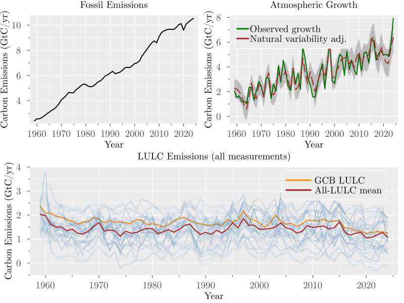

## Background {.unnumbered}

The amount of anthropogenic carbon dioxide ($CO_2$) that can be emitted while still meeting a given temperature goal, known as the remaining carbon budget, depends critically on how efficiently the land–ocean system continues to absorb $CO_2$ emissions. In recent decades, the share of anthropogenic $CO_2$ emissions that remains in the atmosphere, known as the airborne fraction (AF), has been estimated to be around 0.45, but whether it has increased over time remains contested [@Canadell2007; @Raupach2007; @Knorr2009; @Ballantyne2012; @LeQuere2009; @bennedsenEvidenceTrendCO22023; @bennedsenRegressionbasedApproachCO22024;@veravaldes2025robustestimationco2]. 

In its classical form, AF is a yearly ratio of atmospheric growth to total anthropogenic emissions, computed as the sum of fossil fuel emissions and land-use and land-cover change emissions as

$$
AF_t = \frac{G_t}{FF_t + LULC_t},
$${#eq-af-def}

where $G_t$ is the annual atmospheric $CO_2$ growth, $FF_t$ is fossil fuel emissions excluding carbonation, and $LULC_t$ is land-use and land-cover change emissions. AF is a key carbon-cycle diagnostic, with implications for carbon-cycle feedbacks and near-term mitigation planning [@Canadell2007; @Raupach2007; @Friedlingstein2025].

A persistent concern is that AF inference depends on the treatment of land-use and land-cover change (LULC) emissions, which are uncertain and model-dependent in annual carbon-budget accounting. The Global Carbon Budget (GCB) 2025 [@Friedlingstein2025] provides one column of LULC emissions as the average of three bookkeeping models (BLUE [@Hansis2015], OSCAR [@Gasser2020], LUCE [@Qin2024]), but a broader set of model-based LULC alternatives can be constructed from the same source. Estimates that do not incorporate this multi-source LULC information can be underpowered and inference on trend direction becomes less reliable.

Here we address that issue with a statistical design that uses all repeated LULC measurements in a mixed-effects trend framework to obtain more reliable inference. The main specification estimates AF trends from a panel of yearly AF values constructed from each LULC measurement series, with random intercepts and random slopes capturing between-series heterogeneity and inducing within-series dependence over time. As a robustness exercise, we also estimate a two-stage measurement-error weighted least squares (WLS) model that propagates denominator uncertainty from repeated LULC measurements into annual AF uncertainty and uses heteroskedasticity-and-autocorrelation-consistent (HAC) inference [@Fuller1987; @Carroll2006; @NeweyWest1987].

Across specifications that incorporate the multi-source LULC information, we find robust evidence that AF has increased over 1959-2024, and that this conclusion is not driven by the final observation (2024), which shows a large AF value. By contrast, ordinary least squares (OLS) specifications that do not incorporate denominator measurement information provide weaker evidence of a positive trend and are more sensitive to endpoint exclusion. Taken together, the results clarify why AF trend significance has been elusive in the literature and strengthen evidence that a growing share of emitted carbon dioxide is accumulating in the atmosphere.

## Data {.unnumbered}

We use annual Global Carbon Budget 2025 data for 1959-2024, with atmospheric growth $G_t$ from NOAA/ESRL global concentration trends [@Lan2025], fossil emissions excluding carbonation $FF_t$ from the Global Carbon Project fossil dataset [@Friedlingstein2025], and a panel of 69 LULC measurements per year: BLUE [@Hansis2015], OSCAR [@Gasser2020], LUCE [@Qin2024], and peat-augmented [@Conchedda2020; @Mueller2021; @Qiu2021] process-based land-model combinations drawn from the GCB model ensemble [@Haverd2018; @Melton2020; @Lawrence2019; @Fisher2015; @Tian2015; @Ma2022; @Yang2023; @Needham2025; @Felzer2018; @Xia2024; @Yue2024; @Shu2020; @Reick2021; @Poulter2011; @Smith2014; @Schaphoff2018; @Lienert2018; @Vuichard2019; @Walker2017; @Kato2013; @Ito2019] (see Methods). The data is shown in @fig-data.

Two LULC means can be constructed from the panel. First, the GCB LULC mean, defined as the mean of the three bookkeeping models (BLUE, OSCAR, and LUCE), corresponds to the LULC column used in the Global Carbon Budget. Second, the all-LULC mean, defined as the cross-series mean across all 69 LULC measurements. The literature has typically used the GCB LULC mean as the denominator in AF trend estimation, but we show that incorporating the full set of LULC measurements increases the precision of trend estimates and provides more robust inference on trend direction.

::: {.content-visible when-format="html"}
{#fig-data fig-width=8.4 fig-height=4.9}
:::

::: {.content-visible when-format="pdf"}
{#fig-data fig-width=8.4 fig-height=4.9}
:::

::: {.content-visible when-format="typst"}
{#fig-data fig-width=8.4 fig-height=4.9}
:::

## Identification strategy {.unnumbered}

The empirical question is whether AF has a positive linear trend. The key design choice is how to use the full panel of repeated LULC measurements while accounting for within-series dependence and cross-series heterogeneity. OLS on a collapsed annual series discards panel information and hence provides less reliable inference, see results in @tbl-trend-full. Our preferred specification is a mixed-effects model with random intercepts and random slopes by LULC series, allowing correlation across years within each series and capturing unobserved heterogeneity in LULC measurements [@Henderson1953; @Bolker2009] (see Methods).

For each LULC measurement series, we construct a series of AF estimates by year (@eq-af-def), and the model estimates a common time trend across all series while allowing for series-specific intercepts and slopes. Formally, the model can be written as
$$
AF_{t,j} = \alpha_j + \beta_j t +\varepsilon_{t,j},
$$

where

$$
\alpha_j \sim N(\mu_\alpha, \sigma_\alpha^2),\quad
\beta_j \sim N(\mu_\beta, \sigma_\beta^2),\quad
\varepsilon_{t,j} \sim N(0, \sigma_\varepsilon^2).
$$

Here $\mu_\alpha$ and $\mu_\beta$ are the fixed effects (overall intercept and slope), while $\sigma_\alpha^2$ and $\sigma_\beta^2$ capture the variability in intercepts and slopes across LULC measurement series. The error term $\varepsilon_{t,j}$ captures idiosyncratic noise. The key parameter of interest is $\mu_\beta$, which captures the average trend across all LULC measurement series. Incorporating the full panel of LULC measurements in this way allows us to obtain more precise and robust estimates of the AF trend, while accounting for measurement uncertainty and heterogeneity across LULC series.

## Results {.unnumbered}

### Main estimates {.unnumbered}

The main results from estimating the mixed-effects model over the full sample (1959-2024) are shown in @tbl-mixed-effects, and the associated trend lines are shown in @fig-mixed-effects-trend.

| Parameter | Intercept (full) | Slope (full) | Intercept (up to 2023) | Slope (up to 2023) |
|---|---:|---:|---:|---:|
| Estimate | 0.406959 | 0.001103 | 0.413260 | 0.000808 |
| Standard error | 0.005573 | 0.000102 | 0.005586 | 0.000103 |
| p-value | 1.0E-5 | 1.0E-5 | 1.0E-5  | 1.0E-5  |
: Mixed-effects model with random effects for each LULC measurement series. {#tbl-mixed-effects}

The mixed-effects slope is positive and statistically significant (p-value < 1.0E-5), indicating strong evidence of an increasing AF trend across LULC measurement series. The estimated intercept is around 0.407+/-0.006 and the slope is around 0.0011+/-0.0001 per year, implying an increase of about 0.0717 in AF over 1959-2024. These estimates are comparable with the approximately 0.45 AF level reported in the literature [@Raupach2007;@Knorr2009;@Gloor2010CarbonFeedbackAF;@bennedsenRegressionbasedApproachCO22024;@bennedsenEvidenceTrendCO22023;@veravaldes2025robustestimationco2], while identifying a positive long-run trend when all LULC information is incorporated. 

::: {#fig-mixed-effects layout-ncol=1}

{#fig-mixed-effects-trend fig-width=8.4 fig-height=4.9}

{#fig-mixed-effects-trend-2023 fig-width=8.4 fig-height=4.9}

:::

@fig-mixed-effects-trend shows the AF series for each LULC measurement together with the overall mixed-effects trend line. The figure shows a clear positive trend across the panel of AF series, with the mixed-effects model capturing this common signal while allowing for series-specific heterogeneity. 

### Endpoint and model specification robustness {.unnumbered}

AF shows a large value in the final year (2024), so we re-estimate the mixed-effects model on the subsample ending in 2023 to check whether the result is driven by that observation. Results are shown in the last two columns of @tbl-mixed-effects and @fig-mixed-effects-trend-2023. The slope remains positive and statistically significant (p-value < 1.0E-5), indicating that the increasing AF trend is not driven by the final observation. The slope is smaller (0.000808 per year versus 0.001103 per year), consistent with a contribution from the 2024 large value, but the direction and inference are unchanged.

Furthermore, we consider a mixed-effects specification that includes an AR(1) structure on the residuals to control for potential autocorrelation. The results do not materially change, and the slope remains positive and significant under this specification (see Methods).

As an additional robustness check, we estimate a delta-method uncertainty proxy for each annual AF estimate using the cross-measurement dispersion of the full 69-series LULC panel, and use these proxies in WLS with HAC inference [@Fuller1987; @Carroll2006; @Oehlert1992; @NeweyWest1987]. Two WLS specifications are shown in @tbl-trend-full: one using the GCB LULC mean as the denominator and one using the all-LULC mean. In both specifications, weights are constructed from the all-LULC panel dispersion so that the weighting scheme is held fixed across denominator definitions. 

The WLS results are consistent with the mixed-effects results and show a positive, statistically significant trend. Note that the slopes estimated from WLS are steeper than those from OLS or the mixed-effects model, which is consistent with the fact that WLS assigns less weight to years with higher denominator uncertainty, which tend to be the earlier years of the sample. 

| Trend | OLS (GCB) full | OLS (all) full | WLS (GCB) full |  WLS (all) full | OLS (GCB) up to 2023 | OLS (all) up to 2023 | WLS (GCB) up to 2023 | WLS (all) up to 2023  |
|:---|---:|---:|---:|---:|---:|---:|---:|---:|
| Estimate | 0.00158 | 0.00117 | 0.00265  | 0.00230 | 0.00130 | 0.00088 | 0.00237 | 0.00202 |
| Standard error | 0.00077 | 0.00079 | 2.0E-5  | 2.0E-5 | 0.00078 | 0.00080 | 2.0E-5 | 2.0E-5 |
| HAC standard error | 0.00062 | 0.00064 | 0.00065  | 0.00066 | 0.00058 | 0.0006 | 0.00059 | 0.0006 |
| p-value | 0.04021 | 0.13891 | 1.0E-5  | 1.0E-5 | 0.09516 | 0.27109 | 1.0E-5 | 1.0E-5 |
| HAC p-value | 0.01112 | 0.06846 | 4.0E-5  | 0.00050 | 0.02495 | 0.14322 | 5.0E-5 | 0.00080 |
: Trend comparison across OLS and WLS specifications for the full sample and the sample ending in 2023. {#tbl-trend-full}

By contrast, OLS specifications that do not incorporate denominator measurement information show weaker evidence of a positive trend and greater endpoint sensitivity. In the full sample, OLS using GCB LULC is significant under both conventional and HAC inference (p-value 0.04021 and HAC p-value 0.01112), whereas OLS using the all-LULC mean is not significant under either method (p-value 0.13891 and HAC p-value 0.06846). 

In the sample ending in 2023, WLS remains significant under both mean definitions (HAC p-values 5.0E-5 and 0.00080), whereas OLS only remains significant when using the GCB LULC mean (HAC p-values 0.02495 and 0.14322).

This sensitivity to denominator construction and endpoint exclusion highlights the value of incorporating multi-source LULC information in AF trend estimation.

## Discussion and conclusion {.unnumbered}

Using a framework that incorporates all available LULC information from Global Carbon Budget 2025, we find robust evidence that AF increased from 1959 to 2024. Methodologically, incorporating multi-source uncertainty materially changes inference relative to plain OLS. Endpoint tests show that this conclusion is not driven by the large value in 2024.

Our estimates imply that AF increased from about 0.40 around 1960 to about 0.47 by 2024, relative to long-used values around 0.45. For a given emissions pathway, this implies faster atmospheric $CO_2$ growth than under a constant-AF baseline, shrinking the remaining carbon budget for any temperature target [@Canadell2007; @Raupach2007; @Friedlingstein2025]. The increasing AF signal is consistent with broader evidence that the climate system is out of energy balance and has recently shown elevated warming and heating rates [@Miniere2023; @WMO_SGC_2025; @StortoYang2024; @rahmstorfGlobalWarmingHas2025]; these findings should be interpreted in that wider risk context.

::: {.content-visible when-format="html"}

### References {.unnumbered}

:::

:::{#refs}
:::

# Methods {.unnumbered}

Our primary estimator is a linear mixed-effects trend model with random intercepts and random slopes for each LULC measurement series [@Henderson1953; @Bolker2009. As a robustness check, we also estimate a measurement-error-aware airborne fraction variance using repeated yearly denominator measurements, followed by WLS trend estimation with HAC inference [@Fuller1987; @Carroll2006; @Oehlert1992; @Aitken1935; @NeweyWest1987].

## Construction of the LULC measurement panel {.unnumbered}

The repeated LULC measurements are built from the Global Carbon Budget 2025 dataset. We first extract the three bookkeeping series: BLUE [@Hansis2015], OSCAR [@Gasser2020], LUCE [@Qin2024]. Then, for each process-based land-model LULC series in the GCB ensemble that does not already include peat emissions [@Haverd2018; @Melton2020; @Lawrence2019; @Fisher2015; @Tian2015; @Ma2022; @Yang2023; @Needham2025; @Felzer2018; @Xia2024; @Yue2024; @Shu2020; @Reick2021; @Poulter2011; @Smith2014; @Schaphoff2018; @Lienert2018; @Vuichard2019; @Walker2017; @Kato2013; @Ito2019], we add the corresponding peat component to make it comparable to the bookkeeping models, which include peat emissions by construction. Specifically, for each of the 22 process-based series we create three peat-augmented variants by adding FAO_peat, LPX_Bern_peat, and ORCHIDEE_peat [@Conchedda2020; @Mueller2021; @Qiu2021]. This produces 66 derived series, and together with BLUE/OSCAR/LUCE gives a panel of 69 yearly LULC measurements.

## Mixed-effects model {.unnumbered}

The primary estimator is a linear mixed-effects trend model fitted on the panel of yearly AF values constructed from each LULC measurement series. For each year $t$ and series $j$, we define

$$
AF_{t,j} = \frac{G_t}{FF_t + LULC_{t,j}},
$$

and estimate

$$
AF_{t,j} = (\mu_\alpha + u_{\alpha j}) + (\mu_\beta + u_{\beta j})\,t + \varepsilon_{t,j},
$$

with

$$
\begin{bmatrix}u_{\alpha j} \\ u_{\beta j}\end{bmatrix}
\sim N\!\left(
\begin{bmatrix}0\\0\end{bmatrix},
\Sigma_u
\right),
\qquad
\varepsilon_{t,j} \sim N(0,\sigma_\varepsilon^2).
$$

This specification allows each LULC series to have its own level and trend while estimating a common population-average trend $\mu_\beta$. The main estimand is $\mu_\beta$, interpreted as the average annual change in AF across the full set of LULC definitions. Note that this notation is equivalent to the more compact notation in the main text, where $\alpha_j = \mu_\alpha + u_{\alpha j}$ and $\beta_j = \mu_\beta + u_{\beta j}$.

The model is estimated by restricted maximum likelihood [@Henderson1953;@Bolker2009]. Fixed-effect uncertainty is based on model-based standard errors and Wald tests. We report the estimated fixed intercept and slope, standard errors, and p-values.

Identification and interpretation rely on standard mixed-model conditions: (i) conditional linearity in time, (ii) random effects centred at zero and independent across LULC definitions, and (iii) mean-zero residuals conditional on fixed and random effects.

### Robustness checks {.unnumbered}

As an endpoint robustness check, we re-estimate the mixed-effects specification on the sample ending in 2023 to verify that inference on $\mu_\beta$ is not mechanically driven by the final-year observation.

To control for potential autocorrelation in the residuals, we consider a specification that includes an AR(1) structure on $\varepsilon_{t,j}$:

$$
\varepsilon_{t,j} = \rho \varepsilon_{t-1,j} + \eta_{t,j}, \quad \eta_{t,j} \sim N(0,\sigma_\eta^2).
$$

This specification is estimated by maximum likelihood on the full sample and the sample ending in 2023. The results, shown in @tbl-mixed-effects-ar1, do not materially change. The estimated AR(1) parameters in the full sample and the sample ending in 2023 are small and only marginally significant, indicating limited residual autocorrelation after accounting for random effects.

| Parameter | Intercept (full) | Slope (full) | AR1 (full) | Intercept (up to 2023) | Slope (up to 2023) | AR1 (up to 2023) |
|---|---:|---:|---:|---:|---:|---:|
| Estimate | 0.406784 | 0.001117 | 0.063011 | 0.413403 | 0.000806 | 0.056406 |
| Standard error | 0.005673 | 0.000108 | 0.030731 | 0.005677 | 0.000109 | 0.029828 |
| p-value | 1.0E-5 | 1.0E-5 | 0.040326 | 1.0E-5 | 1.0E-5 | 0.058622 |
: Mixed-effects model with random effects for each LULC measurement series and AR(1) structure on residuals. {#tbl-mixed-effects-ar1}

## Weighted least squares estimation approach {.unnumbered}

As a robustness check to the mixed-effects model, we also estimate a two-stage measurement-error-aware WLS model that uses repeated LULC measurements to construct a denominator-uncertainty proxy for each year and HAC inference [@Fuller1987; @Carroll2006; @Oehlert1992; @Aitken1935; @NeweyWest1987].

In the estimation, the yearly denominator is computed as
$$
\hat C_t = FF_t + \bar{LULC}_t, \qquad
\bar{LULC}_t = \frac{1}{n_t}\sum_{j=1}^{n_t} LULC_{tj},
$$

where $n_t=3$ for the GCB LULC mean and $n_t=69$ for the all-LULC mean. In the implemented robustness specification, the yearly weighting term is computed from the cross-measurement dispersion across the full set of 69 LULC values and is then applied to both denominator definitions.

Assume for each time $t=1,\dots,T$ we observe:

-	a single numerator $G_t$ (e.g., atmospheric $CO_2$ growth), and

-	multiple denominator measurements $c_{t1},\dots,c_{t n_t}$ with $n_t \ge 2$, which are noisy observations of a latent $C_t$.

Using the repeated denominator measurements, we construct a year-specific uncertainty proxy for the ratio estimator $AF_t = G_t/C_t$ via the delta method, which captures how dispersion in denominator definitions propagates into AF. The procedure is described in detail next.

### Step 1: Estimate $C_t$ and $AF_t$ {.unnumbered}

1. Construct the denominator estimate at time $t$ as the sample mean across available LULC measurements as
$$
  \hat{C}_t = \frac{1}{n_t} \sum_{j=1}^{n_t} c_{tj}.
$$

We consider two variants of this denominator estimate: one using the GCB LULC column (the mean of BLUE, OSCAR, LUCE) and one using the all-LULC mean (the mean across all 69 LULC measurements).

The cross-measurement dispersion around $\hat{C}_t$ is estimated from the multiple measurements and used as a weighting proxy.

With $n_t \ge 2$, the empirical dispersion proxy is
$$
\widehat{\operatorname{Var}}(\hat C_t)= s_{c,t}^2,
\qquad
s_{c,t}^2=\frac{1}{n_t-1}\sum_{j=1}^{n_t}(c_{tj}-\bar c_t)^2,
\qquad
\bar c_t=\hat C_t.
$$

2.	Form the ratio estimate
$$
AF_t = G_t/\hat C_t.
$$

3. Use the multivariate delta method (shown below) to obtain an estimate of the $AF_t$ uncertainty

$$
\widehat{\operatorname{Var}}(AF_t) = \left(\frac{G_t}{\hat C_t^2}\right)^2 s_{c,t}^2.
$$

### Step 2: WLS regression of $AF_t$ on time {.unnumbered}

For each time $t$, we obtain a point estimate $AF_t$ and an uncertainty proxy that reflects cross-measurement dispersion. We use these quantities to fit a linear trend via WLS:

$$
AF_t = \alpha + \beta t + \varepsilon_t, \quad \varepsilon_t \sim (0, \sigma_t^2), \quad \sigma_t^2 = \operatorname{Var}(AF_t).
$$

In our application, the time index $t$ is the year, and $AF_t$ is the estimated AF for that year. The weighting term is obtained from AF uncertainty from denominator dispersion and varies across years with the spread of the LULC measurement panel. We use this term to weight the regression, giving more weight to years with lower denominator-related uncertainty. The core idea is that years with more consistent LULC measurements provide more reliable AF estimates, and hence should have greater influence on the trend estimation.

Assuming negligible correlation in $\varepsilon_t$ across time, this is WLS with weights $w_t=\frac{1}{\sigma_t^2}$. If we suspect serial correlation, we can use HAC standard errors for inference on $\beta$ without changing the point estimate. In practice, we use a HAC covariance estimator with a Bartlett kernel and Andrews automatic bandwidth selection [@NeweyWest1987]. In the results, we report both conventional and HAC standard errors.

Testing for a time trend is then a test of $\beta=0$ versus $\beta\neq 0$ in this linear model, and WLS uses the repeated denominator information through this delta-method weighting scheme.

## Delta method for ratio variance estimation {.unnumbered}

### Step-by-step derivation (first-order delta method): {.unnumbered}

Define the random vector and the function of interest as
$$
X_t=
\begin{bmatrix}
G_t\\
\hat C_t
\end{bmatrix},
\qquad
g(X_t)=\frac{G_t}{\hat C_t}.
$$

and let 
$$
\sigma_{G,t}^2 = \operatorname{Var}(G_t),\qquad \sigma_{C,t}^2 = \operatorname{Var}(\hat C_t),\qquad \sigma_{GC,t} = \operatorname{Cov}(G_t,\hat C_t).
$$

1. Linearize $g$ around the mean vector $(\mu_{G,t},\mu_{C,t})=\mathbb E[(G_t,\hat C_t)]$:
$$
g(X_t)\approx g(\mu_{G,t},\mu_{C,t})+\nabla g(\mu_{G,t},\mu_{C,t})^\top (X_t-\mathbb E[X_t]).
$$

2. Compute the gradient:
$$
\nabla g(G,C)=
\begin{bmatrix}
\partial g/\partial G\\
\partial g/\partial C
\end{bmatrix}
=
\begin{bmatrix}
1/C\\
-G/C^2
\end{bmatrix}.
$$

3. Write the covariance matrix of $(G_t,\hat C_t)$:
$$
\Sigma_t=
\begin{bmatrix}
\sigma_{G,t}^2 & \sigma_{GC,t}\\
\sigma_{GC,t} & \sigma_{C,t}^2
\end{bmatrix}.
$$

4. Apply the delta-method variance formula
$$
\operatorname{Var}(g(X_t))\approx \nabla g(\mu_{G,t},\mu_{C,t})^\top\Sigma_t\nabla g(\mu_{G,t},\mu_{C,t}),
$$
and with plug-in evaluation at $(G_t,C_t)$, this becomes

$$
\operatorname{Var}(AF_t)\approx\left(\frac{1}{C_t}\right)^2 \sigma_{G,t}^2+\left(\frac{G_t}{C_t^2}\right)^2 \sigma_{C,t}^2-2\frac{G_t}{C_t^3}\sigma_{GC,t}.
$$ 

In practice, we use plug-in estimates (replace unknown moments by their empirical counterparts). This is the standard delta‑method approximation for the variance of a ratio estimator. 

5. In the case analysed in this paper, we have a single numerator measurement from a robust source per time, so we treat $\sigma_{G,t}^2$ and $\sigma_{GC,t}$ as negligible relative to the variance from the denominator measurement error, which is captured by $\sigma_{C,t}^2$. Nevertheless, the formula above is general and can be applied in other contexts where numerator uncertainty is non-negligible or where there is covariance between numerator and denominator measurements. 

Under the assumption of negligible numerator variance and covariance, the formula simplifies to

$$
\operatorname{Var}(AF_t)\approx\left(\frac{G_t}{C_t^2}\right)^2 \sigma_{C,t}^2.
$$

Accordingly, a practical plug-in variance estimator for $AF_t$ is

$$
	\widehat{\operatorname{Var}}(AF_t) = \left(\frac{G_t}{C_t^2}\right)^2 s_{c,t}^2.
$$

## Data availability {.unnumbered}

The study uses publicly available Global Carbon Budget 2025 data and derived yearly series generated from those source files. The processed analysis tables are provided in the manuscript repository under the results directory, and the extracted and derived LULC panel is available as a CSV file in the data directory.

## Code availability {.unnumbered}

All code used to process data, estimate models, and generate figures is available in the repository ([github.com/everval/Airborne-Fraction-WLS-Trend](https://github.com/everval/Airborne-Fraction-WLS-Trend)) under the scripts directory, including Quarto analysis files and Julia and R helper functions.

## Competing interests {.unnumbered}

The author declares no competing interests.

## Additional information {.unnumbered}

Supplementary information is available in the accompanying [supplementary manuscript file](https://everval.github.io/Airborne-Fraction-WLS-Trend/supplementary-preview.html).