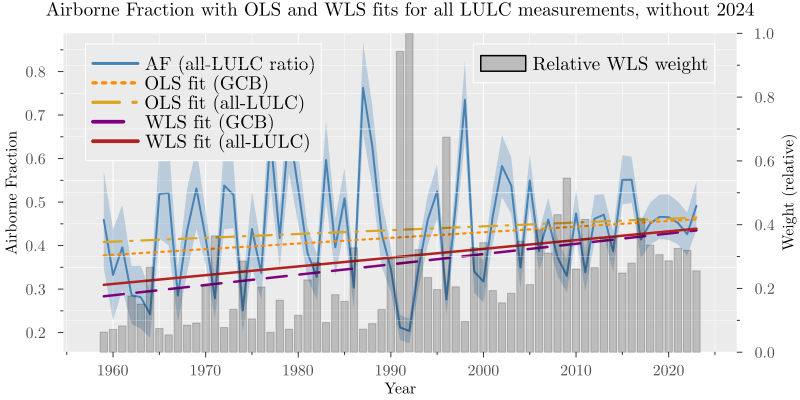

## Background {.unnumbered}

Whether the airborne fraction (AF) is increasing or approximately constant remains contested [@Canadell2007; @Raupach2007; @Knorr2009; @Ballantyne2012; @LeQuere2009; @bennedsenEvidenceTrendCO22023; @bennedsenRegressionbasedApproachCO22024]. In its classical form, AF is a yearly ratio of atmospheric growth to total anthropogenic emissions, computed as the sum of fossil fuel emissions and land-use and land-cover change emissions:

$$
AF_t = \frac{G_t}{FF_t + LULC_t},
$${#eq-af-def}

where $G_t$ is the annual atmospheric $CO_2$ growth, $FF_t$ is fossil fuel emissions excluding carbonation, and $LULC_t$ is land-use and land-cover change emissions. AF is a key carbon-cycle diagnostic, with implications for carbon-cycle feedbacks and near-term mitigation planning [@Canadell2007; @Raupach2007; @Friedlingstein2025].

A persistent concern is that AF inference depends on the treatment of land-use and land-cover change (LULC) emissions, which are uncertain and model-dependent in annual carbon-budget accounting [@Friedlingstein2025]. The Global Carbon Budget (GCB) 2025 dataset provides one column of LULC emissions as the average of three bookkeeping models (BLUE, OSCAR, LUCE), but a broader set of model-based LULC alternatives can be constructed from the same source data. If the information from this broader set of LULC measurements is not incorporated into AF trend inference, tests can be underpowered and inference on trend direction becomes less reliable.

Here we address that issue with a design that incorporates measurement uncertainty to obtain more reliable trend estimates [@Fuller1987; @Carroll2006; @veravaldes2025robustestimationco2]. We present a two-stage estimator that propagates denominator uncertainty from repeated LULC measurements into annual AF variance and then estimates the AF trend by weighted least squares (WLS) with heteroskedasticity- and autocorrelation-consistent (HAC) inference [@NeweyWest1987]. The approach uses cross-measurement dispersion to weight years by precision, rather than treating all years as equally precise as in ordinary least squares (OLS). We find that WLS delivers statistically significant and more stable evidence of positive trend, including under exclusion of the final observation (2024), which shows a large AF jump. For comparison, we estimate OLS on the same AF series, with conventional and HAC standard errors showing weaker evidence of a positive trend and greater sensitivity to endpoint exclusion. This clarifies why evidence based on OLS does not support a clear conclusion about AF trends.

## Data {.unnumbered}

We use annual Global Carbon Budget 2025 data for 1959-2024, with atmospheric growth $G_t$ from NOAA/ESRL global concentration trends [@Lan2025], fossil emissions excluding carbonation $FF_t$ from the Global Carbon Project fossil dataset [@Friedlingstein2025], and a panel of 69 LULC measurements per year: BLUE [@Hansis2015], OSCAR [@Gasser2020], LUCE [@Qin2024], and peat-augmented process-based land-model combinations drawn from the GCB model ensemble [@Haverd2018; @Melton2020; @Lawrence2019; @Fisher2015; @Tian2015; @Ma2022; @Yang2023; @Needham2025; @Felzer2018; @Xia2024; @Yue2024; @Shu2020; @Reick2021; @Poulter2011; @Smith2014; @Schaphoff2018; @Lienert2018; @Vuichard2019; @Walker2017; @Kato2013; @Ito2019], combined with peat components [@Conchedda2020; @Mueller2021; @Qiu2021] (see Methods). The data is shown in @fig-data.

Two LULC means are constructed from the panel. First, the GCB LULC mean, defined as the mean of the three bookkeeping models BLUE, OSCAR, and LUCE, corresponds to the LULC column used in the Global Carbon Budget. Second, the all‑LULC mean, defined as the cross-series mean from all 69 LULC measurements. Uncertainty from the multiple LULC measurements are estimated by the cross-measurement dispersion from the full panel.

::: {.content-visible when-format="html"}
{#fig-data fig-width=8.4 fig-height=4.9}
:::

::: {.content-visible when-format="pdf"}
{#fig-data fig-width=8.4 fig-height=4.9}
:::

::: {.content-visible when-format="typst"}
{#fig-data fig-width=8.4 fig-height=4.9}
:::

## Identification Strategy {.unnumbered}

The empirical question is whether AF has a positive linear trend. The key design choice is how to handle annual denominator uncertainty from multiple LULC measurements. OLS assigns equal precision to all years and therefore discards information from cross-measurement dispersion. Our preferred specification uses delta-method variance estimates [@Cochran1977; @Oehlert1992] to construct year-specific weights and then estimates the trend by WLS, with HAC standard errors for inference [@Aitken1935; @NeweyWest1987] (see Methods).

## Results {.unnumbered}

### Full-sample trends {.unnumbered}

@tbl-trend-full reports full-sample trend estimates for the four specifications: OLS using GCB LULC, OLS using the all-LULC mean, WLS using the GCB LULC with all-LULC weights, and WLS using the all-LULC mean with all-LULC weights.

| Trend, full sample | OLS (GCB) | OLS (all) | WLS (GCB) | WLS (all) |
|:-----|---:|---:|---:|---:|
| Estimate | 0.001581 | 0.001172 | 0.002649 | 0.002305 |
| Standard error | 0.000771 | 0.000792 | 0.000022 | 0.000023 |
| HAC standard error | 0.000621 | 0.000643 | 0.000657 | 0.000672 |
| p-value | 0.040212 | 0.138912 | 0.000000 | 0.000000 |
| HAC p-value | 0.010837 | 0.068425 | 0.000056 | 0.000609 |
| R-squared | 0.061706 | 0.033086 | 0.148987 | 0.111070 |
: Full-sample trend comparison across OLS and WLS specifications. {#tbl-trend-full}

The main finding is that incorporating denominator-measurement information via WLS substantially changes inference relative to both OLS benchmarks. In the full sample, all approaches produce a positive slope, and both WLS specifications provide much stronger evidence than OLS (HAC p-values 0.000056 and 0.000609 versus 0.010837 and 0.068425). The estimated WLS trend is also steeper (0.002305 per year versus 0.001581 and 0.001172), consistent with greater weight on years with lower denominator uncertainty. The WLS slope implies an increase of about $+0.15$ in AF over 1959-2024, compared with about $+0.10$ and $+0.08$ from the two OLS specifications. The R-squared is also higher for WLS, indicating a better fit when accounting for measurement uncertainty. Nevertheless, the R-squared values are small in absolute terms, signaling that AF is a noisy variable and that the trend is only one component of its variation.

@fig-primary-delta-gls shows the AF series using the mean of all LULC measurements together with the associated variance, the OLS trend, and the delta-method WLS trend when using the full sample. The gray bars show the relative weights (standardised so that the maximum weight is 1) assigned to each year in the WLS estimation, which are inversely proportional to the estimated variance of the AF estimate for that year. 

::: {.content-visible when-format="html"}
{#fig-primary-delta-gls fig-width=8.4 fig-height=4.9}
:::

::: {.content-visible when-format="pdf"}
{#fig-primary-delta-gls fig-width=8.4 fig-height=4.9}
:::

::: {.content-visible when-format="typst"}
{#fig-primary-delta-gls fig-width=8.4 fig-height=4.9}
:::

Note that the WLS trends are steeper than the OLS trends, which is consistent with the numerical results in @tbl-trend-full. The WLS specifications assign more weight to the more precisely measured years (e.g., 2000-2020 as shown by the width of the shaded area) and less weight to noisier years (e.g., 1960s-1970s), which helps reveal the positive trend signal in the data.

### Endpoint Robustness {.unnumbered}

The final observation (2024) shows a large increase in AF. To ensure this point is not mechanically driving the result, we re-estimate the same four specifications on the subsample ending in 2023. Results are shown in @tbl-trend-2023 and @fig-endpoint-robustness.

| Trend (up to 2023) | OLS (GCB) | OLS (all) | WLS (GCB) | WLS (all) |
|:-----|---:|---:|---:|---:|
| Estimate | 0.001296 | 0.000878 | 0.002367 | 0.002015 |
| Standard error | 0.000777 | 0.000798 | 0.000022 | 0.000023 |
| HAC standard error | 0.000578 | 0.000600 | 0.000600 | 0.000615 |
| p-value | 0.095163 | 0.271089 | 0.000000 | 0.000000 |
| HAC p-value | 0.024954 | 0.143217 | 0.000081 | 0.001059 |
| R-squared | 0.042332 | 0.018863 | 0.125521 | 0.089297 |
: Subsample (ending in 2023) trend comparison across OLS and WLS specifications. {#tbl-trend-2023}

Results remain qualitatively unchanged for the WLS specifications: both estimated slopes stay positive and statistically significant (0.002367 with HAC p-value = 0.000081, and 0.002015 with HAC p-value = 0.001059). For the sample ending in 2023, OLS using GCB LULC is positive but only marginal under conventional inference (p-value = 0.095), while OLS using the all-LULC mean is not significant (p-value = 0.271). Overall, the WLS results are robust to endpoint exclusion, while OLS results are more sensitive to denominator construction and provide weaker evidence of a positive trend.

::: {.content-visible when-format="html"}
{#fig-endpoint-robustness fig-width=8.4 fig-height=4.9}
:::

::: {.content-visible when-format="pdf"}
{#fig-endpoint-robustness fig-width=8.4 fig-height=4.9}
:::

::: {.content-visible when-format="typst"}
{#fig-endpoint-robustness fig-width=8.4 fig-height=4.9}
:::

### Supplementary Numerical Results {.unnumbered}

While the main focus is on the slope estimates, we also report intercept estimates for completeness. The intercept captures the baseline AF level in 1959, and its estimation can also be affected by denominator measurement error.

Results for the intercept estimates are shown in @tbl-intercept-comparison. 

| Intercept | OLS (GCB) full | OLS (all) full | WLS (GCB) full | WLS (all) full | OLS (GCB) 2023 | OLS (all) 2023 | WLS (GCB) 2023 | WLS (all) 2023 |
|:------------|---:|---:|---:|---:|---:|---:|---:|---:|
| Estimate | $-2.7266$ | $-1.8946$ | $-4.9141$ | $-4.2130$ | $-2.1611$ | $-1.3121$ | $-4.3539$ | $-3.6377$ |
| Standard error | 1.5352 | 1.5777 | 0.0443 | 0.0456 | 1.5461 | 1.5888 | 0.0440 | 0.0453 |
| HAC standard error | 1.2391 | 1.2845 | 1.3212 | 1.3518 | 1.1553 | 1.1994 | 1.2087 | 1.2390 |
| p-value | 0.0757 | 0.2298 | 0.0000 | 0.0000 | 0.1622 | 0.4089 | 0.0000 | 0.0000 |
| HAC p-value | 0.0278 | 0.1402 | 0.0002 | 0.0018 | 0.0614 | 0.2739 | 0.0003 | 0.0033 |
| R-squared | 0.0617 | 0.0331 | 0.1490 | 0.1111 | 0.0423 | 0.0189 | 0.1255 | 0.0893 |   
: Intercept comparison across OLS and WLS specifications for full sample and sample up to 2023. {#tbl-intercept-comparison}

## Discussion and conclusion {.unnumbered}

Using a measurement-error-aware framework, we find robust evidence that AF increased from 1959 to 2024. The key methodological point is that incorporating multi-source denominator uncertainty through delta-method WLS materially changes inference relative to plain OLS. The endpoint test shows that this conclusion is not driven by the 2024 jump.

In practice, the implication is clear: AF trend assessments should report measurement-error-aware weighted estimates, benchmark them against OLS, and document endpoint sensitivity. 

A rising AF implies that a larger share of emitted $CO_2$ remains in the atmosphere over policy-relevant horizons, tightening near-term mitigation requirements for a given temperature objective [@Canadell2007; @Raupach2007; @Friedlingstein2025]. The evidence of an increasing AF is consistent with broader findings that the climate system is out of energy balance and has recently exhibited elevated warming and heating rates; these results should therefore be interpreted within that wider risk context [@Miniere2023; @WMO_SGC_2025; @StortoYang2024; @rahmstorfGlobalWarmingHas2025].

::: {.content-visible when-format="html"}

### References {.unnumbered}

:::

:::{#refs}
:::

# Methods {.unnumbered}

Our primary estimator is a two-stage measurement-error trend model using repeated yearly denominator measurements, followed by weighted trend estimation with HAC inference [@Fuller1987; @Carroll2006; @Oehlert1992; @Aitken1935; @NeweyWest1987].

## Construction of the LULC measurement panel {.unnumbered}

The repeated LULC measurements are built from the Global Carbon Budget 2025 dataset. We first extract the three bookkeeping series (BLUE, OSCAR, LUCE) [@Hansis2015; @Gasser2020; @Qin2024]. Then, for each process-based land-model LULC model in the GCB ensemble which does not already include peat emissions [@Haverd2018; @Melton2020; @Lawrence2019; @Fisher2015; @Tian2015; @Ma2022; @Yang2023; @Needham2025; @Felzer2018; @Xia2024; @Yue2024; @Shu2020; @Reick2021; @Poulter2011; @Smith2014; @Schaphoff2018; @Lienert2018; @Vuichard2019; @Walker2017; @Kato2013; @Ito2019], we add the corresponding peat component to make it comparable to the bookkeeping models, which include peat emissions by construction. Specifically, for each of the 33 process-based land-model combinations in the GCB ensemble we create three peat-augmented variants by adding FAO_peat, LPX_Bern_peat, and ORCHIDEE_peat [@Conchedda2020; @Mueller2021; @Qiu2021]. This produces 66 derived series, and together with BLUE/OSCAR/LUCE gives a panel of 69 yearly LULC measurements.

In the estimation, the yearly denominator is computed as
$$
\hat C_t = FF_t + \bar{LULC}_t, \qquad
\bar{LULC}_t = \frac{1}{n_t}\sum_{j=1}^{n_t} LULC_{tj},
$$

where $n_t=3$ for the GCB LULC mean and $n_t=69$ for the all-LULC mean. The variance of $\hat C_t$ is estimated from the cross-measurement dispersion across the 69 LULC values and is used to construct the year-specific AF variance estimate used for WLS weighting.

Assume for each time $t=1,\dots,T$ we observe:

-	a single numerator $b_t$ (e.g., atmospheric $CO_2$ growth), and

-	multiple denominator measurements $c_{t1},\dots,c_{t n_t}$ with $n_t \ge 2$, which are noisy observations of a latent $C_t$.

Using the repeated denominator measurements, we can estimate the variance of the ratio estimator $a_t = b_t/C_t$ via the delta method, which accounts for the variability in $C_t$ due to measurement error. The procedure is described in detail next.

## Two-step estimation approach {.unnumbered}

We use a two-step approach to estimate the trend in the ratio $a_t = b_t/C_t$ over time, accounting for denominator measurement error. 

### Step 1: Estimate $C_t$ and $a_t$ {.unnumbered}

1. Estimate the “true” denominator at time $t$ as the sample mean across available LULC measurements:
$$
  \hat{C}_t = \frac{1}{n_t} \sum_{j=1}^{n_t} c_{tj}.
$$

We consider two variants of this denominator estimate: one using the GCB LULC column (the mean of BLUE, OSCAR, LUCE) and one using the all-LULC mean (the mean across all 69 LULC measurements).

The variance of $\hat{C}_t$ can be estimated from the multiple measurements. 

With $n_t \ge 2$, an empirical estimator is
$$
\widehat{\operatorname{Var}}(\hat C_t)= s_{c,t}^2,
\qquad
s_{c,t}^2=\frac{1}{n_t-1}\sum_{j=1}^{n_t}(c_{tj}-\bar c_t)^2,
\qquad
\bar c_t=\hat C_t.
$$

2.	Form the ratio estimate
$$
\hat a_t = b_t/\hat C_t.
$$

3. Use the multivariate delta method (shown below) to get an approximate variance of $\hat a_t$

$$
\widehat{\operatorname{Var}}(\hat a_t)\approx\left(\frac{b_t}{\hat C_t^2}\right)^2\widehat{\operatorname{Var}}(\hat C_t).
$$

### Step 2: WLS regression of $\hat{a}_t$ on time {.unnumbered}

For each time $t$, we obtain a point estimate $\hat{a}_t$ and an estimated variance $\widehat{\operatorname{Var}}(\hat a_t)$ that reflects the cross-measurement dispersion. We use these estimates to fit a linear trend via weighted least squares (WLS):

$$
\hat a_t = \alpha + \beta t + \varepsilon_t, \quad \varepsilon_t \sim (0, \sigma_t^2), \quad \sigma_t^2 = \widehat{\operatorname{Var}}(\hat a_t).
$$

In our application, the time index $t$ is the year, and $\hat a_t$ is the estimated AF for that year. The variance $\sigma_t^2$ captures the standard error variance and the uncertainty in the AF estimate due to denominator measurement error, which varies across years depending on the number and variability of the LULC measurements. We use this variance to weight the regression, giving more weight to years with more precise AF estimates.

Assuming negligible correlation in $\varepsilon_t$ across time, this is WLS with weights $w_t=\frac{1}{\sigma_t^2}$. If we suspect serial correlation, we can use HAC standard errors for inference on $\beta$ without changing the point estimate. In practice, we use a HAC covariance estimator with a Bartlett kernel and Andrews automatic bandwidth selection [@NeweyWest1987]. In the results, we report both conventional and HAC standard errors.

Testing for a time trend is then a test of $\beta=0$ versus $\beta\neq 0$ in this linear model, and using WLS we have used all the information in the repeated $\hat{a}_t$'s through the delta‑method approximation.

## Delta method for ratio variance estimation {.unnumbered}

### Step-by-step derivation (first-order delta method): {.unnumbered}

Define the random vector and the function of interest as
$$
X_t=
\begin{bmatrix}
b_t\\
\hat C_t
\end{bmatrix},
\qquad
g(X_t)=\frac{b_t}{\hat C_t}.
$$

and let 
$$
\sigma_{b,t}^2 = \operatorname{Var}(b_t),\qquad \sigma_{C,t}^2 = \operatorname{Var}(\hat C_t),\qquad \sigma_{bC,t} = \operatorname{Cov}(b_t,\hat C_t).
$$

1. Linearize $g$ around the mean vector $(\mu_{b,t},\mu_{C,t})=\mathbb E[(b_t,\hat C_t)]$:
$$
g(X_t)\approx g(\mu_{b,t},\mu_{C,t})+\nabla g(\mu_{b,t},\mu_{C,t})^\top (X_t-\mathbb E[X_t]).
$$

2. Compute the gradient:
$$
\nabla g(b,C)=
\begin{bmatrix}
\partial g/\partial b\\
\partial g/\partial C
\end{bmatrix}
=
\begin{bmatrix}
1/C\\
-b/C^2
\end{bmatrix}.
$$

3. Write the covariance matrix of $(b_t,\hat C_t)$:
$$
\Sigma_t=
\begin{bmatrix}
\sigma_{b,t}^2 & \sigma_{bC,t}\\
\sigma_{bC,t} & \sigma_{C,t}^2
\end{bmatrix}.
$$

4. Apply the delta-method variance formula
$$
\operatorname{Var}(g(X_t))\approx \nabla g(\mu_{b,t},\mu_{C,t})^\top\Sigma_t\nabla g(\mu_{b,t},\mu_{C,t}),
$$
and with plug-in evaluation at $(b_t,C_t)$, this becomes

$$
\operatorname{Var}(\hat a_t)\approx\left(\frac{1}{C_t}\right)^2 \sigma_{b,t}^2+\left(\frac{b_t}{C_t^2}\right)^2 \sigma_{C,t}^2-2\frac{b_t}{C_t^3}\sigma_{bC,t}.
$$ 

In practice, we use plug-in estimates (replace unknown moments by their empirical counterparts). This is the standard delta‑method approximation for the variance of a ratio estimator. 

5. In the case analysed in this paper, we have a single numerator measurement from a robust source per time, so we treat $\sigma_{b,t}^2$ and $\sigma_{bC,t}$ as negligible relative to the variance from the denominator measurement error, which is captured by $\sigma_{C,t}^2$. 

The expression simplifies to
$$
\operatorname{Var}(\hat a_t)\approx\left(\frac{b_t}{C_t^2}\right)^2 \sigma_{C,t}^2.
$$

Accordingly, a practical plug-in estimator is

$$
\widehat{\operatorname{Var}}(\hat a_t)\approx\left(\frac{b_t}{\hat C_t^2}\right)^2\widehat{\operatorname{Var}}(\hat C_t).
$$

## Data availability {.unnumbered}

The study uses publicly available Global Carbon Budget 2025 data and derived yearly series generated from those source files. The processed analysis tables are provided in the manuscript repository under the results directory, and the extracted and derived LULC panel is available as a CSV file in the data directory.

## Code availability {.unnumbered}

All code used to process data, estimate models, and generate figures is available in the repository ([github.com/everval/Airborne-Fraction-WLS-Trend](https://github.com/everval/Airborne-Fraction-WLS-Trend))under the scripts directory, including Quarto analysis files and Julia helper functions.

## Competing interests {.unnumbered}

The author declares no competing interests.

## Additional information {.unnumbered}

Supplementary information is not included.